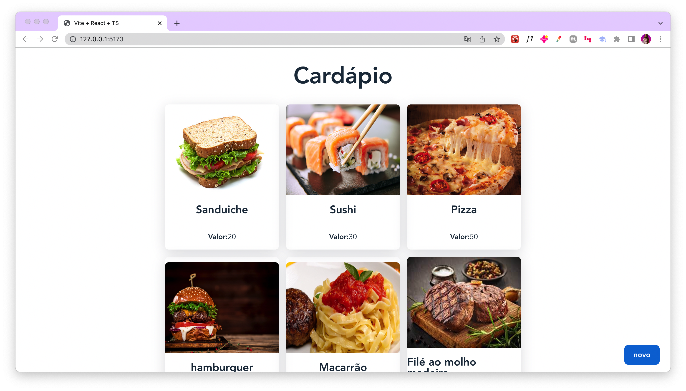

# Cardápio Digital - Aplicação Frontend

Este projeto é um simples protótipo de um Cardápio Digital . A aplicação foi desenvolvida usando **React, TypeScript e React Query**.

<h1 align="center">
    
    
</h1>

---

## 💻 Requisitos

Antes de iniciar, você deve ter o Node.js e o NPM instalados em sua máquina.

---

## 🚀 Instalando

Primeiro, você deve clonar o projeto na sua máquina. Para isso, copie e cole o seguinte comando em seu terminal:

```bash
git clone https://github.com/Fernanda-Kipper/frontend-cardapio.git
cd frontend-cardapio
```

Para instalar as dependências, execute o seguinte comando:

```bash
npm install
```

Por fim, para executar o projeto, rode o comando:

```bash
npm run dev
```

---

## 🔧 Compilação

Para compilar a aplicação para produção, execute o comando:

```bash
npm run build
```

Isso irá gerar uma versão otimizada da aplicação na pasta `dist`.

---

## 🚀 Tecnologias Utilizadas

Este projeto utiliza as seguintes tecnologias:

<h1 align="center">
    
    
    
    
    
</h1>

### Descrição das Tecnologias:
- **ReactJS**: Biblioteca JavaScript para criar interfaces de usuário.
- **TypeScript**: Superset de JavaScript que adiciona tipagem estática.
- **Spring Framework**: Framework Java para criação de aplicações robustas e escaláveis.
- **Java**: Linguagem de programação orientada a objetos amplamente utilizada.
- **PostgreSQL**: Sistema de gerenciamento de banco de dados relacional open-source.

---

## 📝 Licença

Este projeto está licenciado sob a Licença MIT. Consulte o arquivo `LICENSE` para obter mais informações.
